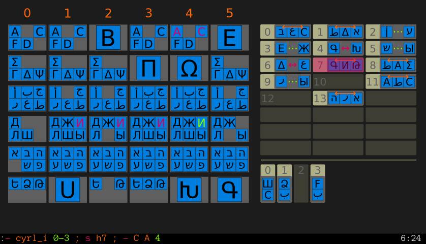

# einstein-puzzle

This version of the classic Einstein game is made to be all used with the keyboard (like vim).

##Usage
It is possible to execute one or multiple action in one command. The formal syntax is the following `<action> ; <action>…`. The last action don’t necessary need to be followed by a `;`.

###Suppressing a letter
You could suppress a letter from a specific column of the main table with the command `<operator> <accusative>… <locative>`.

If the operator is `+` it will supress the mentioned letter from all column witch is NOT specified by the locative. Else if the operator is `-` it will supress the mentioned letter from all column witch is specified by the locative.

The accusative is the letter you want to specify. The unicode character could be directly used but, for latin keyboards, their is ways to write it. Note you can specify multiple letters in one action; you have only to separate it with a space like `+ A ب Δ 3`. See the Accusative section for more inforamtion.

The locative specify the desired column. You can mention one or multiple columns by typing his number but, be carrefull, the columns began by the nunber 0. To specify multiple columns you only have to put theire numbers like `+ A 245`. You can also specify a range by separing the first and the last range column with a dash. Like this : `2-4`. Naturally, it is possible to combine multiple ranges or ranges and individual columns.

####Accusative
You can symply type the unicode character for the letter, so there is six alphabet:
* Latin: ABCDEF
* Greek: ΣΩΠΓΔΨ
* Arabic: ﺃﺏﺝﺭﺱﻃ
* Cyrillic: ДЖИЛШЫ
* Hebrew: אבהעשפ
* Armenian: ԵՁԹՍԽԳ

But because it is not always easy to type non-latin characters, you could type their code or romanisation.

The man form expected by the einstein-game is `<[ISO15924|ISO639|IETF|Full english adjective]>[-|_|]<[Romanized Name|Latin phonic equivalent]>`.

* The ISO15924 provide names of alphabets (latn, grek, arab, cyrl, hebr, armn)
* The ISO639 and IETF provide codes of languages and not of alphabets, so you can only use it when the name of an alphabet is mainly related to a language (so, you can use it for all alphabets exept the cyrillic). The following codes are allowed (For latin: la, lat. For greek: el, ell, gre. For arabic: ar, ara. For hebrew: he, heb. For armenian: hy, arm, hye, grk).
* You can also use the adjectives `latin`, `greek`, `arabic`, `cyrillic`, `hebrew`, and `armenian`.

After you have set the alphabet, you have to specify the letter. Then it depend of the alphabets because the romanisation systems is verry differents.

* For Greek, you can use any of the Beta Code, BGN, PCGN, UN, or ELOT romanisations or the letter’s names. So, for Σ, you can use `s` or `sigma`. For Ω, `o`, `w`, or `omega`. For Π, `p`, or `pi`. For Γ, `g`, or `sigma` (but not `y` because it is also used by the beta code for Psy). For Δ, `d`, or `delta`. For Ψ, `ps` or `psy`.

* Arabic have many romanisations systems. You can use DIN 31635, ArabTeX (a TeX package), the BGN/PCGN, or ISO 233-2. So, for ﺃ, you can use `a`, `alef`, or `alif`. For ﺏ, `b`, `ba`, or `beh`. For ﺝ, `g`, `j`, `jeem`, or `jim`. For ﺭ, `r`, `reh`, or `ra`. For ﺱ, `s`, `seen`, or `sin`. For ﻃ, `t`, `tah`, or `ta`.

* For cyrillic, use ISO 9. So, for Д, you can use `d`, or `de`. For Ж, `z` or `zhe`. For И, `i`. For Л, `l`, or `el`. For Ш, `s` or `sha`. For Ы, `y`, or `yeru`.

* For Hebrew, use ISO 259. For א, use `aleph`. For ב, `b`, or `bet`. For ה, `h`, or `he`. For ע, `ayin`. For ש, `s`, `j`, or `shin`. For פ, `p`, or `pe`.

* For armenian: Ե, `yech`. Ձ, `za`. Թ, `to`. Ս, `men`. Խ, `Kheh`. Գ, `Gim`.

If there is no ambiguious homograph, you can simply type the name of the letter. For example, the arabic letter `jeem` haven’t any homograph in other lines.

Otherwhise, in all cases, you hav an automatic completion for alphabet’s and letter’s code.

###Hidding or un showing informative groups
There is two blocs of informative groups, the horizontal on on the top right and the vertical one in the bottom right.

The general syntaxe to manage informative groups is `<s [v|h]<number>`. The `v` prefix is for vertical informative group and the `h` for horizontal informative group, it is immediatly followed by the number of the group in his range.

##Screenshot

##Other versions
[The Freecode’s Einstein Puzzle](http://freecode.com/projects/einsteinpuzzle)
